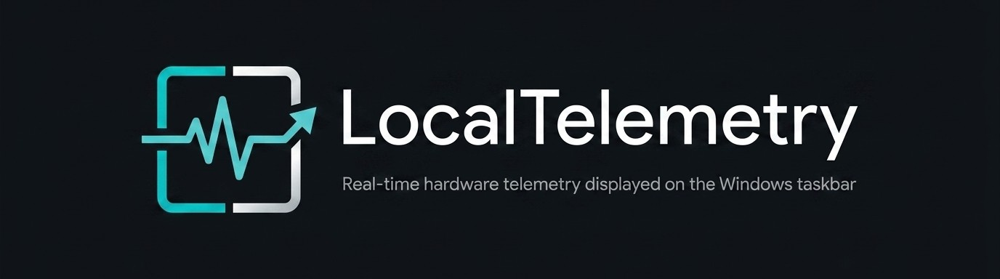
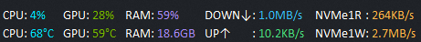
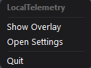
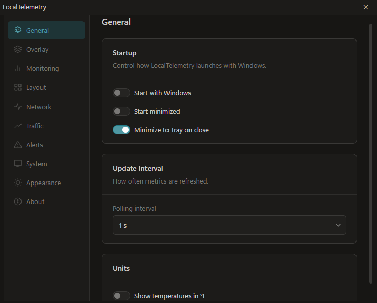
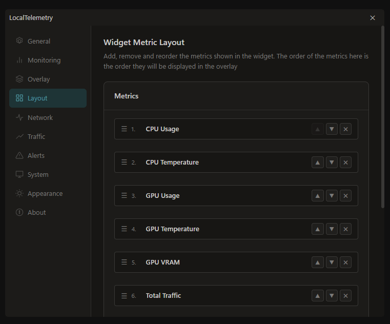
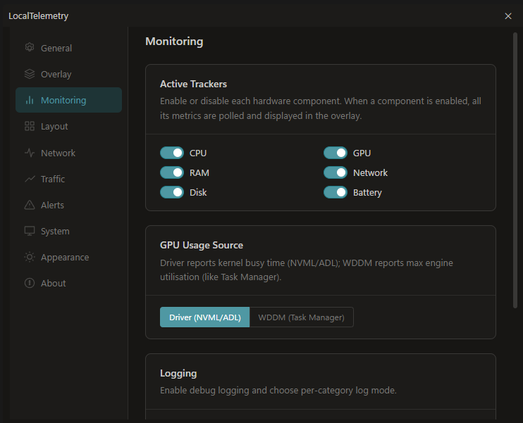
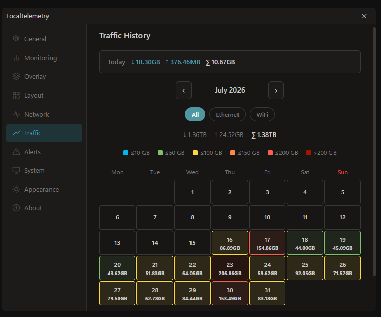
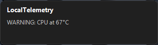

<p align="center">
    
</p>

<p align="center">
    <a href="https://github.com/Nicconike/LocalTelemetry/actions/workflows/ci.yml">
        
    </a>
    <a href="https://github.com/Nicconike/LocalTelemetry/actions/workflows/release.yml">
        
    </a>
    <a href="https://github.com/Nicconike/LocalTelemetry/actions/workflows/docs.yml">
        
    </a>
    <a href="https://github.com/Nicconike/LocalTelemetry">
        
    </a>
    <a href="https://dotnet.microsoft.com/">
        
    </a>
    <a href="https://svelte.dev/">
        
    </a>
    
</p>

<p align="center">
    <a href="https://sonarcloud.io/summary/new_code?id=LocalTelemetry">
        
    </a>
    <a href="https://codecov.io/gh/Nicconike/LocalTelemetry">
        
    </a>
    <a href="https://www.bestpractices.dev/projects/13911">
        
    </a>
    <a href="https://www.bestpractices.dev/projects/13911">
        
    </a>
    <a href="https://scorecard.dev/viewer/?uri=github.com/Nicconike/LocalTelemetry">
        
    </a>
</p>

<p align="center">
    
    <a href="https://wakatime.com/badge/user/018e538b-3f55-4e8e-95fa-6c3225418eed/project/4a017698-b6e1-4859-a4f2-b5379b9a36ef">
        
    </a>
</p>

---

## Key Features

- 📊 **Taskbar Embedded Overlay**: Displays real-time hardware metrics neatly inside your Windows taskbar.
- 🌡️ **CPU & GPU Telemetry**: Track temperatures, usage percentages, clock speeds and package power in real time.
- 💾 **RAM & Storage Monitoring**: Monitor active memory usage and live disk read/write throughput.
- 🌐 **Network & Internet Stats**: Live download/upload speeds with daily bandwidth tracking.
- 🔔 **Custom Threshold Alerts**: Flashing visual warnings and desktop toast notifications when temperatures or usage exceed your thresholds.
- 🎨 **Fully Customizable**: Personalize colors, fonts, metric ordering, placement and update intervals through a clean dark-mode settings panel.
- 🔒 **100% Private & Local**: Zero network tracking, no telemetry phoning home and no external API calls. Your hardware data stays entirely on your machine.
- 🛡️ **No Antivirus False Positives**: Windows Defender and other antivirus engines never flag LocalTelemetry.

---

## System Requirements

| Requirement          | Minimum Specification                                   | Recommended Specification                        |
| :------------------- | :------------------------------------------------------ | :----------------------------------------------- |
| **Operating System** | **Windows 10** (64-bit, v2004+ / build 19041)           | **Windows 11** (64-bit, v22H2+)                  |
| **Architecture**     | **x86-64 / AMD64** (Intel / AMD)                        | **x86-64 / AMD64**                               |
| **Permissions**      | **Administrator (UAC)** *(For hardware sensor drivers)* | **Administrator (UAC)**                          |
| **RAM**              | **2 GB**                                                | **4 GB or higher**                               |
| **Disk Space**       | **200 MB** free space                                   | **200 MB**                                       |
| **Runtime**          | **WebView2 Runtime**                                    | **WebView2 Runtime** *(Pre-installed on Win 11)* |

*Note: 32-bit (x86) Windows versions and ARM processors are currently not supported.*

---

## Download & Installation

### Option 1: Standard Installer (Recommended)

1. Download the latest `LocalTelemetrySetup.exe` from [**GitHub Releases**](https://github.com/Nicconike/LocalTelemetry/releases).
2. Run the installer and follow the quick setup wizard.
3. LocalTelemetry will launch automatically after installation.

> **First launch note:** the very first run asks for Administrator rights once (single UAC prompt), then installs the PawnIo hardware driver silently in the background - the tray icon and overlay can take a few seconds to appear. Subsequent launches start instantly.

### Option 2: Portable ZIP

1. Download `LocalTelemetry-win-x64.zip` from [**GitHub Releases**](https://github.com/Nicconike/LocalTelemetry/releases).
2. Extract the folder to any location on your PC.
3. Run `LocalTelemetry.exe`.

### Verifying Your Download

Every release ships with a `checksums.txt` and [SLSA](https://slsa.dev/) build attestations. You can verify your download before running it:

```pwsh
# 1. Compare the SHA-256 hashes against checksums.txt
Get-FileHash .\LocalTelemetrySetup.exe, .\LocalTelemetry-win-x64.zip -Algorithm SHA256

# 2. Verify the SLSA attestation (proves the file was built by the release workflow)
gh attestation verify .\LocalTelemetrySetup.exe --repo Nicconike/LocalTelemetry
gh attestation verify .\LocalTelemetry-win-x64.zip --repo Nicconike/LocalTelemetry
```

The attestation confirms the binary was produced by the official [**Release workflow**](https://github.com/Nicconike/LocalTelemetry/actions/workflows/release.yml) and has not been tampered with.

---

## Quick Start

### 1. Taskbar Overlay

After launch, LocalTelemetry docks a live telemetry widget directly into your Windows taskbar:



### 2. System Tray Controls

Right-click the **LocalTelemetry icon** in the system tray (near the clock) to control the app:



- **Show / Hide Taskbar Overlay**: Toggle the overlay instantly.
- **Open Settings**: Launch the settings panel.
- **Quit**: Exit LocalTelemetry.

### 3. Settings & Customization

Double-click the tray icon to open the dark-mode settings panel:

**General** - autostart with Windows, launch minimized, polling interval and temperature units:



**Taskbar Layout** - reorder metrics by drag-and-drop to control exactly what appears in the overlay:



**Monitoring** - toggle individual hardware components and enable metrics logging:



**Traffic & Network History** - daily bandwidth calendar with per-interface breakdown:



### 4. Threshold Alerts

Set per-metric warning limits - e.g. CPU at 90°C or GPU at 88°C. When a threshold is crossed, the metric flashes on the overlay and a desktop toast notification pops up without stealing focus:



---

## Getting Help & Support

Need help, found a bug or have a feature suggestion?

- 📖 **Troubleshooting & FAQ**: Read our [**Support Guide**](.github/SUPPORT.md).
- 💬 **Community Discussions**: Ask questions or share ideas on [**GitHub Discussions**](https://github.com/Nicconike/LocalTelemetry/discussions).
- 🐛 **Report an Issue**: Open a bug report via our [**Issue Tracker**](https://github.com/Nicconike/LocalTelemetry/issues).
- 🛠️ **Developers & Contributors**: See [**CONTRIBUTING.md**](CONTRIBUTING.md) for build instructions and code guidelines.

---

## License

LocalTelemetry is free and open-source software licensed under the **GNU General Public License v3.0**. See [`LICENSE`](LICENSE) for details.
