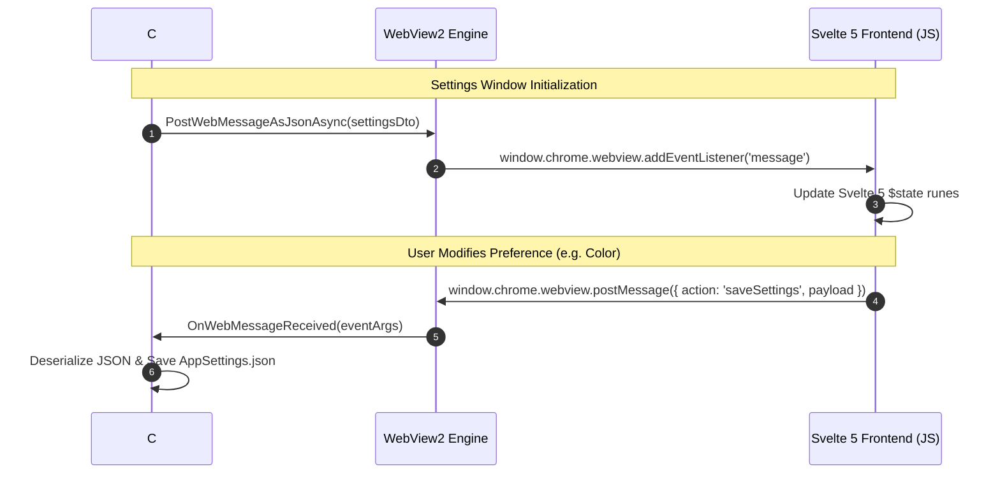

# Svelte 5 Frontend & WebView2 Bridge

LocalTelemetry's settings UI is built using **Svelte 5 Runes**, **Vite**, **TypeScript** and **Bun** hosted inside a native Microsoft WebView2 control.

## 🎨 Tech Stack & Tooling

- **Framework**: Svelte 5 (using modern runes: `$state()`, `$derived()`, `$effect()`).
- **Build Tool**: Vite (`vite.config.js`).
- **Package Manager**: **Bun** (`bun install`, `bun run build`).
- **CSS**: Scoped CSS variables & custom dark theme (`app.css`).

> [!CAUTION]
> **No Legacy Svelte Syntax**: Always use Svelte 5 runes (`$state`, `$derived`, `$effect`). Do NOT use legacy Svelte 3/4 reactive declarations (`$:`) or export let props.


## 🌉 WebView2 Bidirectional IPC Bridge

Communication between the C# WPF backend (`SettingsShell.xaml.cs`) and the Svelte 5 frontend occurs asynchronously via WebView2 JSON Web Messages.



## Frontend Components Layout

```
src/components/
├── App.svelte                    # Root component & WebView2 message listener
├── Sidebar.svelte                # Sidebar tab navigation menu
├── pages/
│   ├── GeneralPage.svelte        # Autostart & run mode
│   ├── OverlayPage.svelte        # Taskbar overlay offsets & alignment
│   ├── MonitoringPage.svelte     # Polling rates & sensor toggles
│   ├── LayoutPage.svelte         # Metric drag-and-drop reordering
│   ├── AppearancePage.svelte     # Metric colors & fonts
│   ├── AlertsPage.svelte         # Threshold limits & toast settings
│   ├── SystemPage.svelte         # Hardware summary & system specs
│   ├── TrafficHistoryPage.svelte # Network logging charts & CSV exports
│   └── AboutPage.svelte          # Version info, updates & open-source credits
└── ui/                           # Reusable UI controls (ColorPicker, ToggleSwitch, Slider)
```
