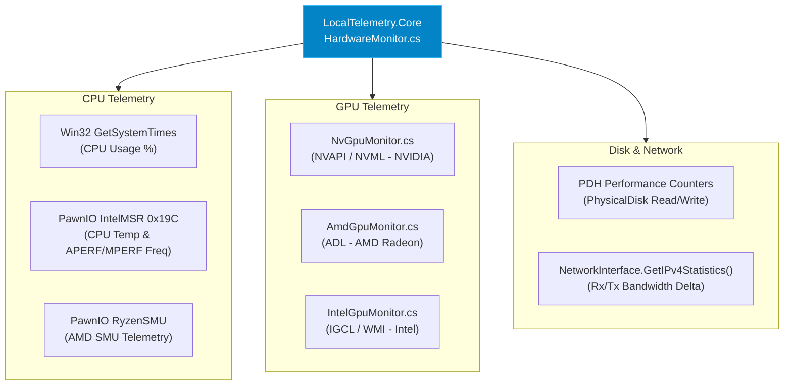

# Hardware Drivers & Sensor Polling

LocalTelemetry reads low-level hardware registers directly from kernel drivers and vendor-provided API libraries. This page explains how driver initialization and sensor polling operate under the hood.

## 🔌 Hardware Sensor Architecture

## Hardware Sensor Sources Summary

| Metric Category            | Primary API Source                           | Fallback / Alternative                          |
| :------------------------- | :------------------------------------------- | :---------------------------------------------- |
| **CPU Usage**              | `GetSystemTimes` (Win32 kernel32 API)        | N/A                                             |
| **CPU Temperature**        | `PawnIO IntelMSR` (Intel MSR)                | `PawnIO RyzenSMU` (AMD SMU)                     |
| **CPU Frequency**          | `PawnIO APERF/MPERF` MSR delta               | `Intel Power Gadget` / `CallNtPowerInformation` |
| **RAM Usage**              | `GlobalMemoryStatusEx` (Win32 API)           | N/A                                             |
| **GPU Utilization & Temp** | `NVML` / `NVAPI` (NVIDIA)                    | `ADL` (AMD) / `IGCL` / WMI (Intel)              |
| **Disk Throughput**        | PDH (`PhysicalDisk\Disk * Bytes/sec\_Total`) | Win32 IOCTL Queries                             |
| **Network Speeds**         | `NetworkInterface.GetIPv4Statistics()` delta | `WindowsNetworkUsageProvider` / ESE SRUDB       |

### 1. PawnIo Kernel Driver

To read CPU package temperatures, MSR (Model-Specific Register) values and Ryzen SMU metrics, LocalTelemetry utilizes the **PawnIo** kernel driver abstraction layer.

- **Driver Subsystem**: Located inside `LocalTelemetry.Core/Hardware/PawnIo/`.
- **Intel Sensor Queries**: MSR registers `IA32_THERM_STATUS` (`0x19C`) and `APERF`/`MPERF` deltas for core frequencies.
- **AMD Sensor Queries**: Interacts with Ryzen SMU (System Management Unit) interface to read package temperatures and SMU telemetry.

### 2. NVIDIA GPU Monitoring (`NvGpuMonitor.cs` & NVML)

GPU monitoring for NVIDIA GeForce graphics cards uses native P/Invoke calls into `nvapi64.dll` and NVML:

- **Functions**:
  - `NvAPI_GPU_GetThermalSettings`: Retrieves GPU core and hotspot temperatures.
  - `NvAPI_GPU_GetDynamicPstatesInfoEx`: Returns GPU engine clock frequency and memory load percentage.
  - `NvAPI_GPU_GetMemoryInfo`: Retrieves dedicated VRAM utilization.

### 3. AMD GPU Monitoring (`AmdGpuMonitor.cs` & ADL)

GPU monitoring for AMD Radeon graphics cards uses the AMD Display Library (`atiadlxx.dll`):

- **Initialization**: Calls `ADL_Main_Control_Create` to initialize ADL context.
- **Sensor Queries**: Fetches core utilization, edge/junction temperatures and VRAM metrics.

### 4. Disk & Network Sensors

- **Disk I/O**: Polled using Windows Performance Data Helper (PDH) performance counters for physical disk read/write bytes per second.
- **Network I/O**: Polled using `NetworkInterface.GetIPv4Statistics()` deltas over active network interfaces.
