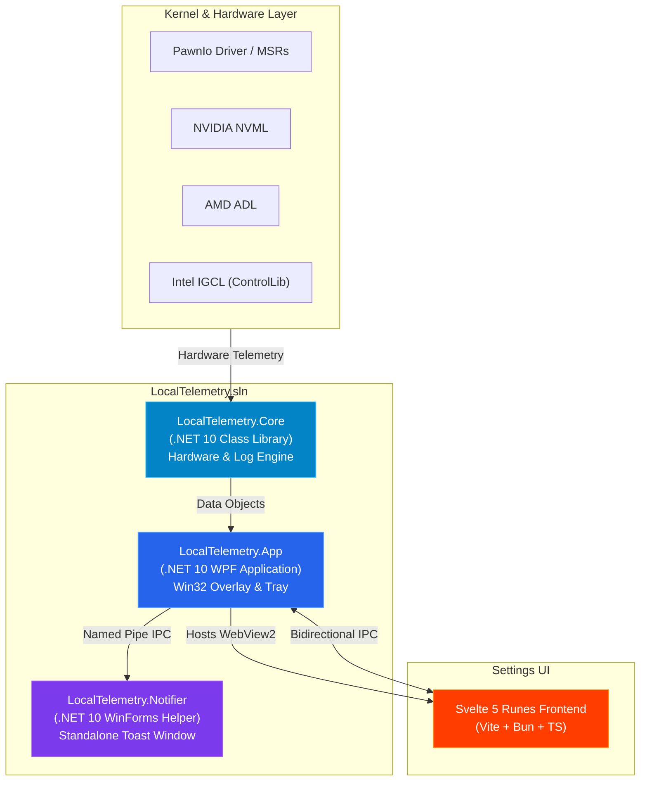

# Developer & Contributor Guide - Architecture Overview

Welcome to the **LocalTelemetry Developer & Contributor Guide**!

This guide is designed for developers, contributors and open-source enthusiasts interested in understanding, building, forking or extending LocalTelemetry.

## 🏗️ High-Level System Architecture

LocalTelemetry is composed of three main projects in a decoupled C# / .NET 10 solution, coupled with a modern Svelte 5 frontend:

## Key Subsystems

### 1. `LocalTelemetry.Core` (`.NET 10 Class Library`)
- **Responsibility**: Hardware sensor monitoring, vendor API bindings (NVML, ADL, Intel ControlLib, WDDM GPU counters), SRUM ESE parsing, `.dat` traffic import and JSON configuration management.
- **Dependencies**: No UI framework dependencies (pure C# logic).

### 2. `LocalTelemetry.App` (`.NET 10 WPF Application`)
- **Responsibility**: Manages the main application lifecycle, Win32 P/Invoke taskbar window docking (`TaskbarOverlay`), System Tray context menu (`TrayIconManager`) and hosting WebView2 for the Svelte 5 settings panel (`SettingsShell`).

### 3. `LocalTelemetry.Notifier` (`.NET 10 WinForms Helper`)
- **Responsibility**: Standalone, lightweight popup notification tool. Receives alert payloads over a **named pipe** (`LocalTelemetryNotifier`) and exits automatically when the main app (its parent process) closes.

### 4. Svelte 5 Settings UI (`src/LocalTelemetry.App/Settings/wwwroot`)
- **Responsibility**: Modern dark-mode configuration UI built with Svelte 5 runes (`$state`, `$derived`, `$effect`), Vite, Bun and TypeScript. Communicates with WPF via bidirectional `window.chrome.webview` JSON messaging.

## Next Steps for Developers

- [**Development Environment Setup**](./setup.md)
- [**Repository Structure**](./repository-structure.md)
- [**Core Engine & App Backend**](./backend-architecture.md)
- [**Hardware Drivers & PawnIo Integration**](./hardware-drivers.md)
- [**Win32 Taskbar Hooking & Overlay**](./taskbar-overlay-interop.md)
- [**Svelte 5 Frontend & WebView2 Bridge**](./frontend-webview2.md)
- [**Standalone Notifier IPC**](./notifier-ipc.md)
- [**Building & Packaging**](./building-and-packaging.md)
- [**CI/CD Workflows**](./ci-cd.md)
- [**Contributing Guidelines**](./contributing.md)
