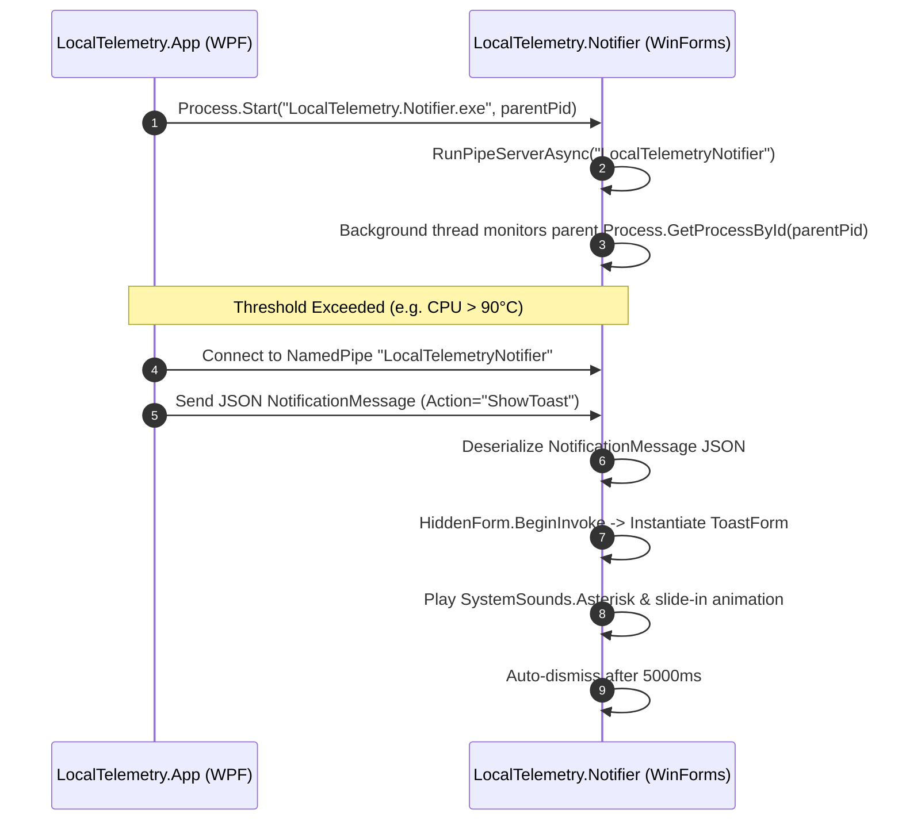

# Standalone Notifier IPC Subsystem

**LocalTelemetry.Notifier** is a standalone, lightweight WinForms executable (`LocalTelemetry.Notifier.exe`) targeting .NET 10 Windows x64. It is dedicated to rendering non-blocking desktop toast alert windows.

## Why a Standalone Process?

Rendering alert windows with slide-in animations and auto-dismiss timers inside the main application process carries two key risks:
1. **Focus Stealing**: Window activation during full-screen gaming or video playback could cause games to minimize.
2. **UI Thread Blocking**: Animation loops on the main UI thread could delay telemetry sensor polling ticks.

By spinning up `LocalTelemetry.Notifier.exe` as a secondary process, notifications display smoothly without stealing foreground focus or blocking hardware monitoring threads.

## 📡 Named Pipe IPC Communication

`LocalTelemetry.App` launches `LocalTelemetry.Notifier.exe` passing its **Parent Process ID (PID)** as `args[0]`. Inter-process communication takes place over an asynchronous Windows **Named Pipe** (`LocalTelemetryNotifier`).



### JSON Message Contract (`NotificationMessage`)

`NotificationClient.cs` serializes messages over the pipe in UTF-8 JSON Lines format:

```json
{
  "Action": "ShowToast",
  "Title": "CPU Temperature Warning",
  "Body": "CPU reached 91°C (Limit: 90°C)"
}
```

```csharp
internal sealed record NotificationMessage
{
    public string Action { get; set; } = string.Empty;
    public string? Title { get; set; }
    public string? Body { get; set; }
}
```

### Command Actions
- `ShowToast`: Triggers `ToastForm` rendering on screen with `Title` and `Body`.
- `Shutdown`: Gracefully cancels `CancellationTokenSource` and closes `HiddenForm`.

## 🖥️ Hidden Message Pump (`HiddenForm`)

Inside `Program.cs`, an invisible `HiddenForm` provides a WinForms message pump:
- Hidden from Alt+Tab via `WS_EX_TOOLWINDOW` (`0x00000080`) extended window style.
- `ShowInTaskbar = false`, `WindowState = Minimized`, `Opacity = 0`.
- Receives pipe messages on a background thread (`RunPipeServerAsync`) and dispatches toast creation to the UI thread via `hiddenForm.BeginInvoke(...)`.

## 🎨 Toast Window Rendering & Animation (`ToastForm.cs`)

`ToastForm` renders a custom dark alert window:
- **Dimensions**: `320px` width × `90px` height.
- **Appearance**: Dark background (`Color.FromArgb(32, 32, 32)`), rounded corners (`CornerRadius = 8` via `GraphicsPath`), border pen (`Color.FromArgb(60, 60, 60)`).
- **Audio Cue**: Plays system asterisk sound (`SystemSounds.Asterisk.Play()`).
- **Ease-Out Slide-In Animation**: `OnLoad` animates the window position from below the screen working area using a cubic ease-out curve (`1.0 - Math.Pow(1.0 - t, 3)`) over `300ms`.
- **Auto-Dismiss**: A `System.Windows.Forms.Timer` automatically closes the toast window after `5000ms`.

## 🛡️ Parent Process Monitoring & Auto-Exit

When `LocalTelemetry.Notifier.exe` receives `parentPid` as `args[0]`:
1. Launches a background worker task: `Process.GetProcessById(parentPid).WaitForExit()`.
2. When the parent `LocalTelemetry.exe` process exits, the notifier process automatically logs exit and shuts down cleanly.
