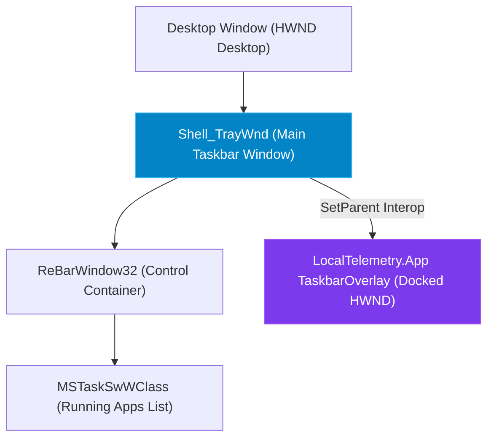

# Win32 Taskbar Hooking & Overlay Interop

LocalTelemetry embeds a high-performance GDI+ render surface (`NativeWindow`) directly into the native Windows taskbar process (`Shell_TrayWnd`).

## 🛠️ Win32 Taskbar Hierarchy

The taskbar overlay management is handled inside `TaskbarOverlay.cs` and `TaskbarEmbedder.cs` (`src/LocalTelemetry.App/Overlay/` & `Win32/`).



## Embedding Approaches (TaskbarEmbedder)

LocalTelemetry implements a 2-tier embedding strategy:

### 1. Approach A: Child-Window Reparenting (`IsChildMode`)
- **Find Taskbar HWND**: `FindWindow("Shell_TrayWnd", null)` locates the primary taskbar window handle.
- **Find ReBar / TaskBand**: `FindWindowEx(trayHwnd, IntPtr.Zero, "ReBarWindow32", null)` retrieves the control container and taskband (`MSTaskSwWClass`).
- **Reparent Window (`SetParent`)**: Calls Win32 `SetParent(overlayHwnd, parentHwnd)` to reparent the overlay window as a native child control of the taskbar.
- **Shrink TaskBand (`ShrinkTaskBand`)**: Dynamically reduces taskband width to reserve dedicated space for the overlay metrics on the taskbar.
- **Apply Window Styles (`SetWindowLong`)**: Sets `WS_CHILD`, `WS_EX_TOOLWINDOW` (hides from Alt+Tab), `WS_EX_NOACTIVATE`, and `WS_EX_LAYERED`.

### 2. Approach B: Layered Floating Window Fallback (`IsFallback`)
- Used if reparenting fails due to third-party shell software or security policies.
- Restores top-level window styles (`WS_POPUP`, `WS_EX_TOPMOST`) and positions a transparent layered floating window precisely over the taskbar bounding rectangle.


## DPI Awareness & Scaling

Queries `GetDpiForWindow` to dynamically scale GDI+ font rendering, text margins, and line heights for 4K displays and custom DPI scaling settings (125%, 150%, 200%+).


## Windows Explorer Restart Recovery

When `explorer.exe` crashes or restarts, all child handles of `Shell_TrayWnd` are destroyed by Windows.

LocalTelemetry overrides the Win32 `WndProc` message hook to listen for the registered Win32 message `TaskbarCreated`:

```csharp
private IntPtr WndProc(IntPtr hwnd, int msg, IntPtr wParam, IntPtr lParam, ref bool handled)
{
    if (msg == _taskbarCreatedMsg)
    {
        Log.Info("TaskbarCreated message received. Re-attaching overlay...");
        ReattachOverlay();
    }
    return IntPtr.Zero;
}
```

This guarantees seamless recovery without user intervention.
